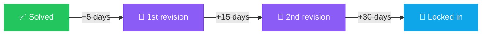

<div align="center">

# ☕ Java Switch Tracker

### Mission control for switching into a stronger Java backend role.

*A 12-week battle plan, a 502-problem DSA gauntlet, and a spaced-repetition engine that refuses to let you forget what you solved.*

<br />


<br />

**502** problems · **239** checklist items · **84** planned days · **29** badges · **8** levels

</div>

---

## 🎯 Why this exists

Most prep advice dies in a Google Sheet. You solve a problem on a Tuesday, feel clever, and three weeks later you cannot remember why the sliding window shrinks.

This tracker fixes the two things spreadsheets never do:

1. **It tells you what to do today** — a dependency-ordered plan, not a pile of topics.
2. **It brings problems back before you forget them** — every solve is automatically re-queued at 5, 15 and 30 days.

Everything is saved in your browser, so it works offline. Add a free Supabase project and the same progress follows you from laptop to phone.

---

## ✨ What's inside

| | Feature | What it does |
|:-:|---|---|
| 📊 | **Dashboard** | Progress ring, level, daily goal, streak, and your "up next" plan day |
| 🔁 | **Revision queue** | Spaced repetition over every problem you solve — the headline feature |
| 🧮 | **DSA sheet** | 502 problems across 9 phases and 23 topics, with a 5-stage status pipeline |
| 🗓️ | **Study plan** | 84 day-by-day sessions across 12 weeks, grouped into 3 months |
| 📚 | **Topic sheets** | 239 interview talking points across Core Java, Spring, SQL, System Design and more |
| 🔥 | **Streaks & points** | Difficulty-weighted scoring, streak bonuses, and 8 levels to climb |
| 🏅 | **Achievements** | 29 badges for consistency, volume and revision discipline |
| 📈 | **Activity heatmap** | A GitHub-style grid of your last ~18 weeks |
| 📝 | **Code notes** | Jot the approach or gotcha on any problem, right where you solved it |
| ☁️ | **Cloud sync** | Optional Supabase login so progress follows you across devices |

---

## 🔁 The revision engine

The part that makes this more than a checklist. Mark a problem **Done** and a clock starts — you do not schedule anything by hand.



**How it behaves**

- Each round is due a fixed gap after the *previous* one — so a problem you keep recalling drifts further away instead of nagging you.
- Clear all three rounds and the problem is **locked in** and leaves the queue for good.
- Not feeling it today? **⏰ Snooze** pushes a problem to tomorrow *without* counting as a revision.
- Changed your mind? **↺ Undo** rolls back a revision you logged by mistake.
- Overdue problems are flagged in red and float to the top.

Reminders surface everywhere you actually look — a banner on the **Dashboard** and **DSA sheet**, a live count badge in the sidebar, and a purple `🔁 Revise` marker on the individual rows that are due.

> The 5-day base interval is a setting, not a law. Slide it in **Settings** and the whole schedule (base × 1, × 3, × 6) re-derives from it.

---

## 🏆 Points & levels

Harder problems are worth more, so grinding easy wins will not carry you to Level 8.

<table>
<tr><td valign="top">

**Points earned**

| Action | Points |
|---|:-:|
| ★☆☆☆☆ Very Easy | 10 |
| ★★☆☆☆ Easy | 15 |
| ★★★☆☆ Medium | 20 |
| ★★★★☆ Hard | 30 |
| ★★★★★ Very Hard | 40 |
| Topic checklist item | 10 |
| Study-plan day | 15 |

</td><td valign="top">

**Levels unlocked**

| Lv | Title | Points |
|:-:|---|--:|
| 1 | Beginner | 0 |
| 2 | Apprentice | 150 |
| 3 | Practitioner | 400 |
| 4 | Developer | 800 |
| 5 | Senior | 1,400 |
| 6 | Expert | 2,200 |
| 7 | Architect | 3,200 |
| 8 | **Interview Ready** | 4,500 |

</td></tr>
</table>

---

## 🚀 Quick start

```bash
cd learning-tracker
npm install
npm run dev
```

Open the URL it prints — by default <http://localhost:5173>. That is genuinely it: no database, no account, no config. Progress lands in `localStorage` immediately.

**Build for production**

```bash
npm run build     # -> dist/
npm run preview   # serve dist/ locally to sanity-check it
```

---

## ☁️ Cloud sync (optional)

The app is fully functional offline. Turn this on only if you want the same progress on your phone and laptop.

<details>
<summary><b>Step 1 · Create a Supabase project</b></summary>

<br />

Head to [supabase.com](https://supabase.com), sign up on the free tier, and click **New project**. Give it a name and database password, pick a nearby region, and wait about a minute for it to provision.

</details>

<details>
<summary><b>Step 2 · Create the progress table</b></summary>

<br />

Open the **SQL Editor** in the Supabase dashboard, paste this, and hit **Run**:

```sql
-- One row per user, storing the whole tracker state as JSON
create table if not exists public.progress (
  user_id uuid primary key references auth.users on delete cascade,
  data jsonb not null default '{}'::jsonb,
  updated_at timestamptz not null default now()
);

-- Row Level Security: each user can only see/change their own row
alter table public.progress enable row level security;

create policy "own progress - select" on public.progress
  for select using (auth.uid() = user_id);
create policy "own progress - insert" on public.progress
  for insert with check (auth.uid() = user_id);
create policy "own progress - update" on public.progress
  for update using (auth.uid() = user_id);
```

</details>

<details>
<summary><b>Step 3 · Add your keys</b></summary>

<br />

In Supabase go to **Project Settings → API** and copy the **Project URL** and the **anon public** key. Then:

```bash
cp .env.example .env
```

```env
VITE_SUPABASE_URL=https://your-project-ref.supabase.co
VITE_SUPABASE_ANON_KEY=your-anon-public-key
```

Restart `npm run dev`. A **Cloud sync** card now appears in **Settings** — sign up or log in, and syncing starts automatically.

</details>

<details>
<summary><b>Step 4 · Email confirmation & Google login</b></summary>

<br />

Supabase asks new users to confirm their email by default. For a personal tool you can switch that off under **Authentication → Providers → Email → Confirm email**.

For **Continue with Google**, configure the Google provider under **Authentication → Providers → Google** and add your site URL to the allowed redirect URLs.

</details>

> 🔐 The `anon` key is designed to be public. Row Level Security is what protects your data — each user can only ever read or write their own row.

---

## 🌐 Deploy to Netlify

`netlify.toml` and `public/_redirects` are already committed, so the SPA fallback works and refreshing `/revision` or `/dsa` will not 404.

```bash
npm run build   # publishes dist/
```

| Setting | Value |
|---|---|
| Base directory | `learning-tracker` |
| Build command | `npm run build` |
| Publish directory | `dist` |

⚠️ **Set the base directory to `learning-tracker`.** `package.json` lives in that subfolder, not at the repo root — Netlify will not find the build without it.

If you use cloud sync, add `VITE_SUPABASE_URL` and `VITE_SUPABASE_ANON_KEY` under **Site settings → Environment variables** (Vite inlines them at build time), then add your Netlify URL to Supabase under **Authentication → URL Configuration**.

---

## 🧱 Tech & structure

**React 18** · **Vite 5** · **React Router 6** · **Supabase** · plain CSS, no UI framework

```
learning-tracker/
├── netlify.toml            # SPA redirects + build config
├── public/_redirects       # /* -> /index.html (200)
└── src/
    ├── pages/              # Dashboard, StudyPlan, DSASheet, Revision,
    │                       # TopicSheet, Achievements, Settings
    ├── components/         # Layout, banners, heatmap, rings, notes
    ├── context/            # ProgressContext — the single source of truth
    ├── data/               # dsaMasterSheet · curriculum · studyPlan · achievements
    ├── lib/                # supabase client
    └── utils/              # revision · streak · gamification · date · mergeState
```

All progress flows through one `ProgressContext`, which writes to `localStorage` on every change and reconciles with Supabase when you are signed in. `utils/mergeState.js` handles the awkward case — the same account edited on two devices — by keeping the earliest solve date, unioning revision history, and taking the latest snooze.

---

## 🔒 Your data

Progress lives in **your** browser, and in **your** Supabase project if you choose to create one. Nothing is sent anywhere else. **Settings** has one-click **Export** and **Import** so you can keep a JSON backup, plus a **Reset** if you want a clean slate.

---

<div align="center">

### Open it daily. Clear the plan day. Empty the revision queue.

*Consistency compounds — that is the entire trick.*

<br />

<sub>Built for a 3-YOE developer doing mostly fresh learning · DSA master sheet generated by the **Digital COE Gen AI Team**</sub>

</div>
